# Architecture and Model Design

Generated from:
- `ai-assisted-workflow/docs/brd.md`
- `ai-assisted-workflow/docs/project-plan.md`
- `ai-assisted-workflow/skills/ARCHITECTURE_STANDARD.md`

## 1. Scope and Conventions

- API base path: `/api`
- Resource path style: singular lowercase (`/api/product`, `/api/borrowing/:recordId/repayment`)
- Model names: `PascalCase` singular; collections plural lowercase
- IDs: `ObjectId`
- DTO fields: `camelCase`
- Auth levels per route: `PUBLIC`, `AUTH`, `AUTH+OWNER`, `AUTH+PARTICIPANT`, `AUTH+ELIGIBLE`, `SYSTEM`
- Error code format: `MODULE_REASON` (reuse BRD codes exactly)
- Success and error envelope are mandatory for every endpoint

## 2. Data Models

### 2.1 Identity

- `User` (`users`)
  - Fields: `_id:ObjectId`, `email:string`, `passwordHash:string`, `displayName:string`, `storefrontName:string?`, `bio:string?`, `avatarUrl:string?`, `accountStatus:enum(ACTIVE|DEACTIVATED)`, `activeOrganizationId:ObjectId?`, `createdAt:datetime`, `updatedAt:datetime`
  - Relationships: 1:N with `AuthSession`, `AccountRecoveryToken`, `AccountStatusEvent`; 1:N ownership for commerce and org entities
  - Constraints/Indexes: unique `email`; index `accountStatus`, `activeOrganizationId`

- `AuthSession` (`auth_sessions`)
  - Fields: `_id`, `userId:ObjectId`, `refreshTokenHash:string`, `deviceInfo:object`, `expiresAt:datetime`, `revokedAt:datetime?`, timestamps
  - Constraints/Indexes: unique `refreshTokenHash`; index `(userId, expiresAt)`

- `AccountRecoveryToken` (`account_recovery_tokens`)
  - Fields: `_id`, `userId:ObjectId`, `tokenHash:string`, `expiresAt:datetime`, `consumedAt:datetime?`, `attemptCount:int`, `createdAt`
  - Constraints/Indexes: unique `tokenHash`; TTL index on `expiresAt`; one-time use

- `AccountStatusEvent` (`account_status_events`)
  - Fields: `_id`, `userId:ObjectId`, `fromStatus:enum`, `toStatus:enum`, `reason:string`, `actorUserId:ObjectId?`, `createdAt`
  - Constraints/Indexes: append-only; index `(userId, createdAt)`

### 2.2 Connections and Organizations

- `ConnectionRequest` (`connection_requests`)
  - Fields: `_id`, `requesterUserId:ObjectId`, `receiverUserId:ObjectId`, `status:enum(PENDING|ACCEPTED|REJECTED|CANCELLED|EXPIRED)`, `respondedAt?`, timestamps
  - Constraints/Indexes: requester != receiver; unique pending directed pair; index by receiver/requester + status

- `Connection` (`connections`)
  - Fields: `_id`, `userLowId:ObjectId`, `userHighId:ObjectId`, `sourceRequestId:ObjectId?`, `createdAt`
  - Constraints/Indexes: canonical sorted pair (`userLowId < userHighId`); unique pair; index both participant columns

- `ConnectionNotification` (`connection_notifications`)
  - Fields: `_id`, `userId:ObjectId`, `type:enum`, `referenceType:enum`, `referenceId:ObjectId`, `isRead:boolean`, `createdAt`
  - Constraints/Indexes: index `(userId, isRead, createdAt)`

- `Organization` (`organizations`)
  - Fields: `_id`, `name:string`, `slug:string`, `description:string?`, `ownerUserId:ObjectId`, `status:enum(ACTIVE|ARCHIVED)`, timestamps
  - Constraints/Indexes: unique `slug`; index `ownerUserId`

- `OrganizationMembership` (`organization_memberships`)
  - Fields: `_id`, `organizationId:ObjectId`, `userId:ObjectId`, `role:enum(ADMIN|MEMBER)`, `status:enum(ACTIVE|REMOVED)`, `joinedAt`, `removedAt?`, timestamps
  - Constraints/Indexes: unique active `(organizationId, userId)`; index `(organizationId, role, status)`; at least one admin invariant

- `OrganizationInvite` (`organization_invites`)
  - Fields: `_id`, `organizationId:ObjectId`, `invitedUserId:ObjectId`, `invitedByUserId:ObjectId`, `status:enum(PENDING|ACCEPTED|DECLINED|EXPIRED)`, `expiresAt`, `respondedAt?`, `createdAt`
  - Constraints/Indexes: unique pending invite per org+user; index by invitee and org status

- `OrganizationJoinRequest` (`organization_join_requests`)
  - Fields: `_id`, `organizationId:ObjectId`, `requesterUserId:ObjectId`, `status:enum(PENDING|APPROVED|REJECTED|CANCELLED)`, `reviewedByUserId?`, `reviewedAt?`, timestamps
  - Constraints/Indexes: unique pending request per org+user; index by org status

### 2.3 Marketplace

- `ProductListing` (`product_listings`)
  - Fields: `_id`, `sellerUserId:ObjectId`, `title:string`, `description:string?`, `category:string`, `price:decimal`, `currency:string`, `quantityAvailable:int`, `visibility:enum(PUBLIC|PRIVATE)`, `status:enum(ACTIVE|ARCHIVED|SOLD_OUT)`, `imageUrls:string[]?`, timestamps
  - Constraints/Indexes: price >= 0; quantity >= 0; index seller/status, visibility/status; text index on title+description+category

- `ListingLifecycleEvent` (`listing_lifecycle_events`)
  - Fields: `_id`, `listingId:ObjectId`, `actorUserId:ObjectId`, `eventType:enum`, `beforeState:object?`, `afterState:object?`, `reason:string?`, `createdAt`
  - Constraints/Indexes: append-only; index `(listingId, createdAt)`

- `SuggestionLayoutPreference` (`suggestion_layout_preferences`)
  - Fields: `_id`, `userId:ObjectId`, `layoutMode:enum(GRID|COMPACT|CARD)`, `sortMode:enum(RECENT|PRICE_LOW|PRICE_HIGH)`, timestamps
  - Constraints/Indexes: unique `userId`

### 2.4 Transactions

- `Transaction` (`transactions`)
  - Fields: `_id`, `sellerUserId:ObjectId`, `buyerUserId:ObjectId`, `recordedByUserId:ObjectId`, `productListingId:ObjectId?`, `amount:decimal`, `currency:string`, `transactionDate:datetime`, `note:string?`, `status:enum(POSTED|VOIDED)`, `invoiceStatus:enum(NONE|PENDING_SCAN|READY|REJECTED)`, `voidedAt?`, `voidReason?`, timestamps
  - Constraints/Indexes: seller != buyer; amount > 0; index seller/buyer/date and status/date

- `TransactionInvoice` (`transaction_invoices`)
  - Fields: `_id`, `transactionId:ObjectId`, `storageKey:string`, `mimeType:enum(image/jpeg|image/png|image/webp)`, `size:int`, `sha256:string`, `scanStatus:enum(PENDING|CLEAN|INFECTED|FAILED)`, `uploadedByUserId:ObjectId`, `uploadedAt`, timestamps
  - Constraints/Indexes: one invoice per transaction; unique `transactionId`, `storageKey`; index `scanStatus`

- `TransactionAdjustment` (`transaction_adjustments`)
  - Fields: `_id`, `transactionId:ObjectId`, `action:enum(CORRECT|VOID)`, `reason:string`, `beforeSnapshot:object`, `afterSnapshot:object`, `actorUserId:ObjectId`, `createdAt`
  - Constraints/Indexes: append-only audit log; index `(transactionId, createdAt)`

### 2.5 Borrowing and Reporting

- `BorrowingRecord` (`borrowing_records`)
  - Fields: `_id`, `ownerUserId:ObjectId`, `counterpartyUserId:ObjectId`, `direction:enum(BORROWED|LENT)`, `assetType:enum(MONEY|ITEM)`, `principalAmount:decimal?`, `currency:string?`, `itemDescription:string?`, `quantity:decimal?`, `dueDate`, `status:enum(UNPAID|PARTIALLY_PAID|PAID|PAID_LATE)`, `remainingBalance:decimal`, `termsNote:string?`, `closedAt?`, timestamps
  - Constraints/Indexes: owner != counterparty; state-machine status progression; index owner/counterparty/status/dueDate

- `Repayment` (`repayments`)
  - Fields: `_id`, `borrowingRecordId:ObjectId`, `amount:decimal`, `paidAt`, `note:string?`, `actorUserId:ObjectId`, `createdAt`
  - Constraints/Indexes: amount > 0 and bounded by remaining balance; index `(borrowingRecordId, paidAt)`

- `SettlementNote` (`settlement_notes`)
  - Fields: `_id`, `borrowingRecordId:ObjectId`, `note:string`, `actorUserId:ObjectId`, `createdAt`
  - Constraints/Indexes: 1..1000 chars; index `(borrowingRecordId, createdAt)`

- `BorrowingAuditEntry` (`borrowing_audit_entries`)
  - Fields: `_id`, `borrowingRecordId:ObjectId`, `eventType:enum`, `payload:object`, `actorUserId:ObjectId`, `createdAt`
  - Constraints/Indexes: append-only; index `(borrowingRecordId, createdAt)`

- `CommerceMetricSnapshot` (`transaction_metric_snapshots`)
  - Fields: `_id`, `userId:ObjectId`, `rangeStart`, `rangeEnd`, `revenue:decimal`, `expense:decimal`, `profit:decimal`, `uniqueCustomers:int`, `transactionCount:int`, `invoiceCount:int`, `computedAt`, `sourceVersion:int`
  - Constraints/Indexes: index `(userId, computedAt)` and `(userId, rangeStart, rangeEnd, sourceVersion)`

- `BorrowingMetricSnapshot` (`borrowing_metric_snapshots`)
  - Fields: `_id`, `userId:ObjectId`, `rangeStart`, `rangeEnd`, `totalLent:decimal`, `totalBorrowed:decimal`, `outstandingReceivable:decimal`, `outstandingPayable:decimal`, `overdueCount:int`, `computedAt`, `sourceVersion:int`
  - Constraints/Indexes: index `(userId, computedAt)` and `(userId, rangeStart, rangeEnd, sourceVersion)`

- `ReportViewPreset` (`report_view_presets`)
  - Fields: `_id`, `userId:ObjectId`, `name:string`, `module:enum(COMMERCE|BORROWING|UNIFIED)`, `filters:object`, `isDefault:boolean`, timestamps
  - Constraints/Indexes: unique `(userId, name)`; index `(userId, module)`

- `ReportExportJob` (`report_export_jobs`)
  - Fields: `_id`, `userId:ObjectId`, `module:enum`, `format:enum(CSV|XLSX)`, `filters:object`, `status:enum(QUEUED|PROCESSING|READY|FAILED|EXPIRED)`, `storageKey:string?`, `errorCode:string?`, `expiresAt`, timestamps
  - Constraints/Indexes: index `(userId, createdAt)`, `(status, createdAt)`; TTL cleanup on `expiresAt`

### 2.6 Cross-Model Invariants

- Private listing access: allow if `visibility=PUBLIC`, else allow only when active connection or shared active organization membership exists.
- Transaction and borrowing adjustment/history tables are append-only.
- Account deactivation blocks new sessions and protected actions while preserving historical records.
- Borrowing transitions: `UNPAID -> PARTIALLY_PAID -> PAID` or direct `UNPAID -> PAID`; late final payment yields `PAID_LATE`.

## 3. Entity Relationship Diagram (Mermaid)

```mermaid
erDiagram
    User ||--o{ AuthSession : has
    User ||--o{ AccountRecoveryToken : has
    User ||--o{ AccountStatusEvent : has
    User ||--o{ ConnectionRequest : requester
    User ||--o{ ConnectionRequest : receiver
    User ||--o{ Connection : participant
    User ||--o{ ConnectionNotification : receives

    User ||--o{ Organization : owns
    Organization ||--o{ OrganizationMembership : has
    User ||--o{ OrganizationMembership : belongs
    Organization ||--o{ OrganizationInvite : has
    Organization ||--o{ OrganizationJoinRequest : has

    User ||--o{ ProductListing : sells
    ProductListing ||--o{ ListingLifecycleEvent : emits
    User ||--|| SuggestionLayoutPreference : has

    User ||--o{ Transaction : seller_buyer
    ProductListing o|--o{ Transaction : context
    Transaction ||--o| TransactionInvoice : has
    Transaction ||--o{ TransactionAdjustment : has

    User ||--o{ BorrowingRecord : participant
    BorrowingRecord ||--o{ Repayment : has
    BorrowingRecord ||--o{ SettlementNote : has
    BorrowingRecord ||--o{ BorrowingAuditEntry : has

    User ||--o{ CommerceMetricSnapshot : has
    User ||--o{ BorrowingMetricSnapshot : has
    User ||--o{ ReportViewPreset : has
    User ||--o{ ReportExportJob : has
```



## 4. API Route Map

Response envelope for all routes:

Success
```json
{ "success": true, "data": {}, "meta": {}, "requestId": "req_xxx", "timestamp": "ISO-8601" }
```

Error
```json
{ "success": false, "error": { "code": "MODULE_REASON", "message": "...", "details": [] }, "requestId": "req_xxx", "timestamp": "ISO-8601" }
```

List query params: `page`, `limit`, `sort`, `order`, `query`, `filter`, `fields`, optional `count`, `pagination`, `document`.
| Requirement ID | Routes (method path) | Auth | Request shape | Response shape | Primary error codes |
|---|---|---|---|---|---|
| `IDENTITY-001` | `POST /api/auth/register`; `POST /api/auth/login` | PUBLIC | register/login credentials | `{ user, accessToken, sessionToken }` | `IDENTITY_INVALID_INPUT`, `IDENTITY_AUTH_FAILED`, `RATE_LIMITED` |
| `IDENTITY-002` | `GET /api/user/me`; `PATCH /api/user/me/profile` | `AUTH+OWNER` | profile fields | `{ user }` | `IDENTITY_PROFILE_INVALID`, `IDENTITY_PROFILE_SAVE_FAILED` |
| `IDENTITY-003` | `POST /api/auth/recovery/request`; `POST /api/auth/recovery/confirm` | PUBLIC | `{ email }`; `{ token, newPassword }` | recovery status | `IDENTITY_RECOVERY_EXPIRED`, `IDENTITY_RECOVERY_RATE_LIMITED` |
| `IDENTITY-004` | `POST /api/user/me/deactivate` | `AUTH+OWNER` | `{ confirmationText }` | `{ accountStatus }` | `IDENTITY_DEACTIVATION_NOT_CONFIRMED`, `IDENTITY_DEACTIVATION_FAILED` |
| `CONNECTIONS-001` | `POST /api/connection/request`; `PATCH /api/connection/request/:requestId/status`; `DELETE /api/connection/:connectionId` | `AUTH`; `AUTH+OWNER`; `AUTH+PARTICIPANT` | send/respond/remove | request/connection status | `CONNECTIONS_DUPLICATE_REQUEST`, `CONNECTIONS_REQUEST_NOT_PENDING`, `CONNECTIONS_SELF_ACTION` |
| `CONNECTIONS-002` | `GET /api/connection/request/incoming`; `GET /api/connection/request/outgoing`; `GET /api/connection` | AUTH | list queries | `{ requests[] }` / `{ connections[] }` | `CONNECTIONS_LIST_LOAD_FAILED`, `CONNECTIONS_INVALID_PAGE` |
| `CONNECTIONS-003` | `GET /api/notification/connection`; `PATCH /api/notification/:notificationId/read` | `AUTH`; `AUTH+OWNER` | list/read update | `{ notifications[] }` / `{ notification }` | `CONNECTIONS_NOTIFICATION_FAILED`, `CONNECTIONS_NOTIFICATION_SUPPRESSED` |
| `ORGS-001` | `POST /api/organization`; `GET /api/organization` | AUTH | create/list org | `{ organization }` / `{ organizations[] }` | `ORGS_NAME_INVALID`, `ORGS_CREATE_FAILED` |
| `ORGS-002` | `POST /api/organization/:orgId/invite`; `POST /api/organization/:orgId/join-request`; `PATCH /api/organization/:orgId/join-request/:requestId/status`; `PATCH /api/organization/:orgId/invite/:inviteId/status` | `AUTH+PARTICIPANT`; `AUTH`; `AUTH+PARTICIPANT`; `AUTH+OWNER` | invite/join/approve payloads | invite/join/membership status | `ORGS_MEMBERSHIP_ALREADY_EXISTS`, `ORGS_APPROVAL_FORBIDDEN` |
| `ORGS-003` | `GET /api/organization/:orgId/membership`; `PATCH /api/organization/:orgId/membership/:membershipId/role`; `DELETE /api/organization/:orgId/membership/:membershipId` | `AUTH+PARTICIPANT` | roster/role/remove payloads | `{ memberships[] }` / `{ membership }` | `ORGS_ROLE_INVALID`, `ORGS_LAST_ADMIN_PROTECTED` |
| `ORGS-004` | `GET /api/user/me/organization`; `PUT /api/user/me/active-organization` | `AUTH+OWNER` | `{ organizationId }` | active org context | `ORGS_CONTEXT_FORBIDDEN`, `ORGS_CONTEXT_SWITCH_FAILED` |
| `BORROWING-001` | `POST /api/borrowing` | AUTH | create borrowing/lending payload | `{ record }` | `BORROWING_INVALID_INPUT`, `BORROWING_COUNTERPARTY_INVALID` |
| `BORROWING-002` | `POST /api/borrowing/:recordId/repayment` | `AUTH+PARTICIPANT` | `{ amount, paidAt, note? }` | `{ record, repayment }` | `BORROWING_OVERPAYMENT_INVALID`, `BORROWING_RECORD_CLOSED` |
| `BORROWING-003` | `GET /api/borrowing/:recordId`; `GET /api/borrowing/:recordId/repayment` | `AUTH+PARTICIPANT` | record/history query | `{ record, repayments[] }` | `BORROWING_HISTORY_LOAD_FAILED`, `BORROWING_NOT_FOUND`, `BORROWING_AUDIT_UNAVAILABLE` |
| `BORROWING-004` | `POST /api/borrowing/:recordId/settlement-note`; `GET /api/dashboard/borrowing` | `AUTH+PARTICIPANT`; `AUTH+OWNER` | note payload; range filter | `{ noteEntry }`; `{ metrics, overdue[] }` | `BORROWING_NOTE_INVALID`, `BORROWING_OVERDUE_CALC_FAILED`, `REPORTING_DASHBOARD_PARTIAL` |
| `MARKETPLACE-001` | `POST /api/product`; `PATCH /api/product/:productId` | `AUTH`; `AUTH+OWNER` | create/update listing | `{ product }` | `MARKETPLACE_PRODUCT_INVALID`, `MARKETPLACE_VISIBILITY_INVALID`, `MARKETPLACE_LISTING_FORBIDDEN` |
| `MARKETPLACE-002` | `GET /api/product/:productId`; `GET /api/user/:userId/listing` | PUBLIC | context-aware read | `{ product }` / `{ products[] }` | `MARKETPLACE_PRIVATE_FORBIDDEN`, `MARKETPLACE_ACCESS_STATE_UNKNOWN` |
| `MARKETPLACE-003` | `GET /api/marketplace`; `GET /api/search` | PUBLIC | browse/search query | `{ products[] }` | `MARKETPLACE_LIST_LOAD_FAILED`, `MARKETPLACE_SEARCH_INVALID` |
| `MARKETPLACE-004` | `GET /api/user/:userId/listing` | PUBLIC | profile listing query | `{ products[], visibilityScope }` | `MARKETPLACE_PROFILE_VISIBILITY_PARTIAL`, `MARKETPLACE_PROFILE_NOT_FOUND` |
| `MARKETPLACE-005` | `PATCH /api/product/:productId/archive`; `PATCH /api/product/:productId/unarchive`; `PATCH /api/product/:productId/inventory` | `AUTH+OWNER` | lifecycle/inventory payloads | `{ product }` | `MARKETPLACE_STATE_CONFLICT`, `MARKETPLACE_LISTING_FORBIDDEN` |
| `MARKETPLACE-006` | `GET /api/suggestion`; `PUT /api/user/me/suggestion-layout` | `AUTH`; `AUTH+OWNER` | feed query; layout payload | `{ products[], layout }`; `{ preference }` | `MARKETPLACE_SUGGESTIONS_LOAD_FAILED`, `MARKETPLACE_PREF_SAVE_FAILED` |
| `TRANSACTIONS-001` | `POST /api/transaction`; `GET /api/transaction/:transactionId` | `AUTH`; `AUTH+PARTICIPANT` | transaction payload; detail read | `{ transaction }` | `TRANSACTIONS_AMOUNT_INVALID`, `TRANSACTIONS_PARTICIPANT_REQUIRED`, `TRANSACTION_NOT_FOUND` |
| `TRANSACTIONS-002` | `POST /api/transaction/:transactionId/invoice/presign`; `POST /api/transaction/:transactionId/invoice/attach`; `GET /api/transaction/:transactionId/invoice/download` | `AUTH+PARTICIPANT` | file metadata; attach payload | `{ uploadUrl, storageKey }`; `{ invoice }`; `{ downloadUrl }` | `TRANSACTIONS_INVOICE_FILE_INVALID`, `TRANSACTIONS_INVOICE_UPLOAD_FAILED` |
| `TRANSACTIONS-003` | `GET /api/dashboard/commerce`; `POST /api/system/metric/commerce/recompute` | `AUTH+OWNER`; SYSTEM | range filter; recompute payload | `{ metrics, trend[] }`; `{ queued }` | `TRANSACTIONS_PERIOD_INVALID`, `TRANSACTIONS_METRICS_RECALC_FAILED` |
| `TRANSACTIONS-004` | `POST /api/transaction/:transactionId/adjustment`; `POST /api/transaction/:transactionId/void` | `AUTH+PARTICIPANT` | adjustment/void payload | `{ transaction, adjustment }` | `TRANSACTIONS_ADJUST_FORBIDDEN`, `TRANSACTIONS_ADJUST_REASON_REQUIRED` |
| `REPORTING-001` | `GET /api/dashboard/commerce`; `GET /api/dashboard/borrowing` | `AUTH+OWNER` | `{ rangeStart, rangeEnd }` | dashboard metrics payloads | `REPORTING_DASHBOARD_PARTIAL`, `REPORTING_FILTER_INVALID`, `REPORTING_DATA_UNAVAILABLE` |
| `REPORTING-002` | `GET /api/report/preset`; `POST /api/report/preset`; `PATCH /api/report/preset/:presetId`; `DELETE /api/report/preset/:presetId`; `POST /api/report/export`; `GET /api/report/export/:jobId`; `GET /api/report/export/:jobId/download` | `AUTH+OWNER` | preset/export payloads | preset and export job payloads | `REPORTING_PRESET_INVALID`, `REPORTING_EXPORT_FAILED` |
## 5. Authentication and Authorization Strategy

### 5.1 Authentication

- Access token: JWT, TTL 15 minutes
- Session token: refresh token persisted as hash in `auth_sessions`, TTL 30 days
- Recovery token: one-time token with TTL 15 minutes
- Deactivation behavior: revokes active sessions and blocks new sign-ins

### 5.2 Guard Chain

1. `requireAuth` (session validity and active account)
2. `requireEligibleCommerceProfile` for commerce routes
3. Resource guard:
   - `requireOwner` for `/api/user/me/*`, own listings, own reports
   - `requireParticipant` for connections, transactions, borrowing
4. Domain rule guard:
   - organization admin rule for invite/approval/role/removal
   - private listing eligibility (`connection OR shared active organization`)
5. `requireSystemToken` for `/api/system/*`

### 5.3 Authorization Summary

- Visitor: public browse/search and public profile/listing views only
- Registered user: create/manage own profile/listings/reports; participate in borrowing and transactions they are part of
- Organization admin: membership approval, invites, role updates, removals
- System actor: metric recomputation routes only

## 6. Error Response Standards

### 6.1 Canonical Error Shape

```json
{
  "success": false,
  "error": {
    "code": "MODULE_REASON",
    "message": "Human-readable message",
    "details": [
      { "field": "price", "issue": "min_value", "value": "-1" }
    ]
  },
  "requestId": "req_abc123",
  "timestamp": "2026-02-19T00:00:00.000Z"
}
```

### 6.2 HTTP Mapping

- `400` malformed request/query
- `401` unauthenticated or invalid session
- `403` authenticated but forbidden
- `404` resource not found
- `409` state conflict/concurrency conflict
- `422` business-rule validation failure
- `429` rate-limited
- `500` internal error
- `503` dependency unavailable

### 6.3 Error Code Policy

- Return BRD codes unchanged for module errors (`IDENTITY_*`, `CONNECTIONS_*`, `ORGS_*`, `BORROWING_*`, `MARKETPLACE_*`, `TRANSACTIONS_*`, `REPORTING_*`)
- Generic shared codes: `UNAUTHORIZED`, `FORBIDDEN`, `RATE_LIMITED`
- Every error includes `error.code`, `error.message`, optional `error.details[]`, and `requestId`

## 7. Caching Strategy

Redis cache policy (read-heavy only):

- Key format: `cache:{resource}:{scope}:{keyParts}`
- TTL defaults:
  - detail views: 300s
  - list views: 60s
  - dashboard summaries: 30s
  - export job status: 15s

Cache targets:
- public marketplace/search responses
- product detail and profile listing responses (viewer-scoped for private access safety)
- suggestion feed
- commerce and borrowing dashboards
- export status polling

Invalidation:
- Product writes invalidate product/list/search/profile caches
- Connection/org membership changes invalidate affected private-listing caches
- Transaction writes/adjustments/invoice updates invalidate transaction and commerce dashboard caches
- Borrowing writes/repayments/notes invalidate borrowing detail and dashboard caches
- Preset/export updates invalidate report preset/export caches

Freshness target:
- dashboard and history data reflects confirmed writes within 5 seconds (stricter than BRD 5-minute requirement)

## 8. File and Media Handling

Invoice image handling (`TRANSACTIONS-002`):

1. `POST /api/transaction/:transactionId/invoice/presign` validates `{ mimeType, size, sha256 }` and returns presigned upload URL.
2. Client uploads directly to object storage.
3. `POST /api/transaction/:transactionId/invoice/attach` links uploaded object to transaction.
4. Background malware scan updates `scanStatus`; only `CLEAN` files are downloadable.

Policy:
- Allowed MIME types: `image/jpeg`, `image/png`, `image/webp`
- Max size: 10 MB
- Max attachments: 1 invoice image per transaction
- Stored metadata: `storageKey`, `mimeType`, `size`, `sha256`, `scanStatus`
- Download only via signed URL + participant/owner authorization checks

## 9. Review Gate

- Model relationships match BRD requirements and ownership boundaries: PASS
- API surface complete; every BRD requirement has routes: PASS
- Auth guards and role/participant checks are explicit: PASS
- Error response format and code strategy are consistent: PASS
