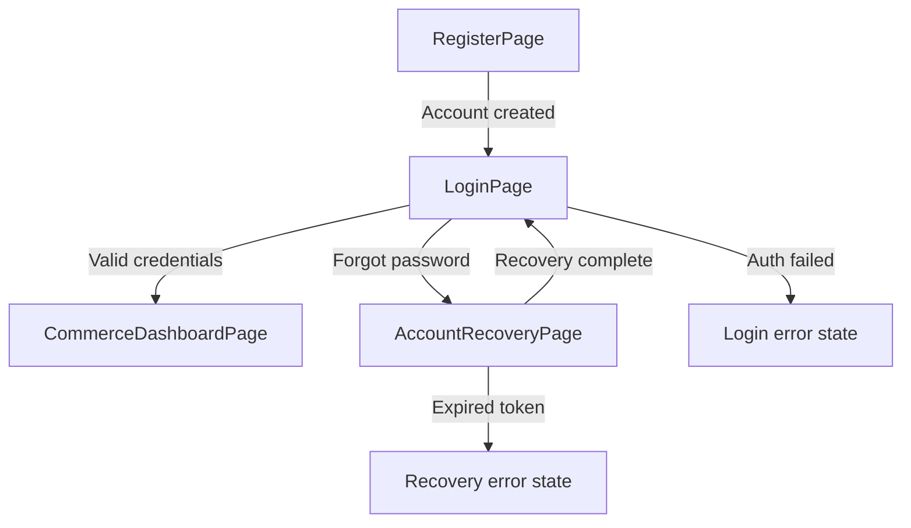
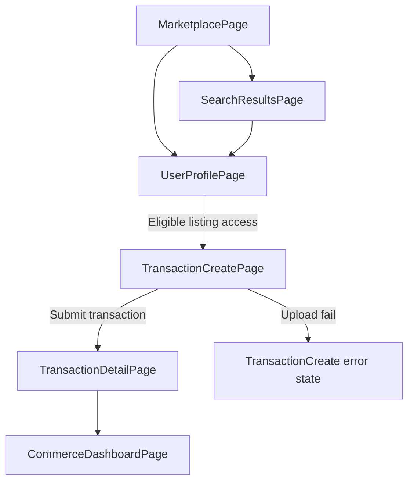
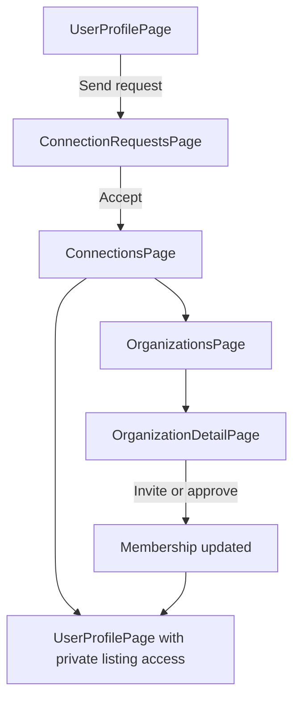
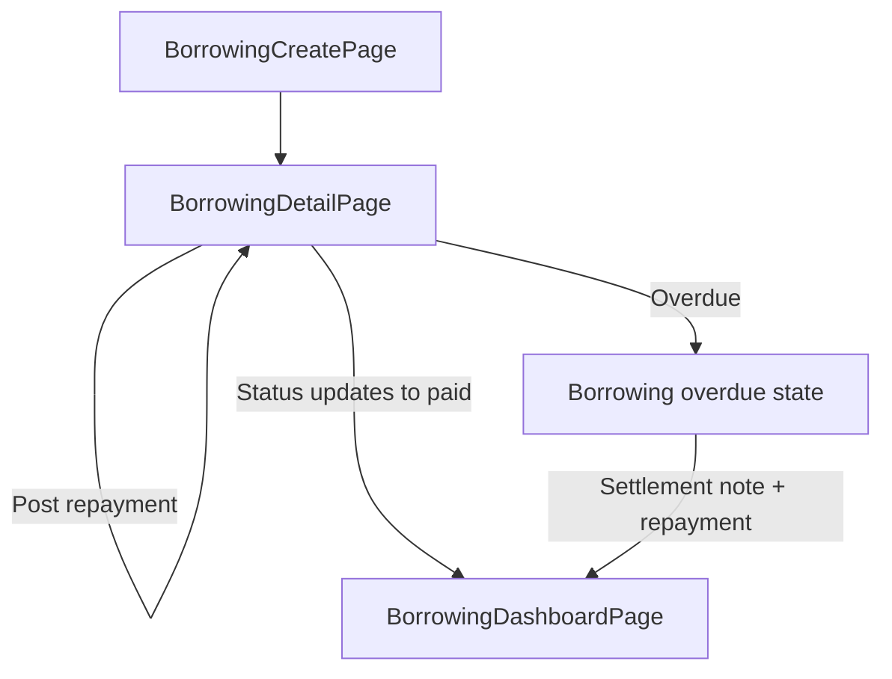
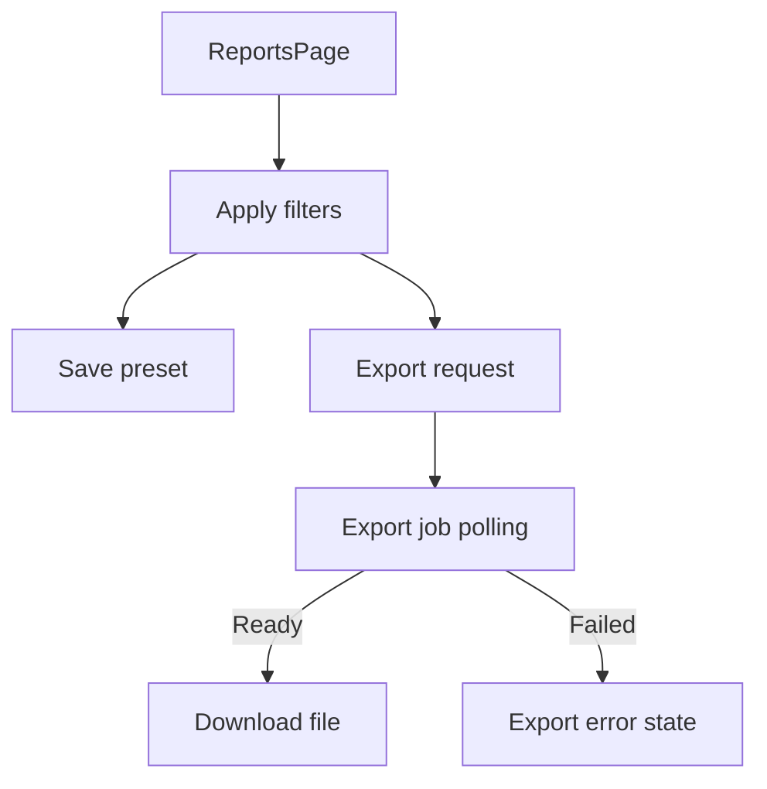

# UI Design

Generated: 2026-02-20  
Sources: `ai-assisted-workflow/docs/brd.md` (Page Manifest), `ai-assisted-workflow/docs/architecture.md` (route/data awareness), provided reference screenshot (visual style only)

## 1. Style Guide

### 1.1 Visual Direction
- Mobile-first dark interface with deep green-black surfaces, bright emerald actions, soft card elevation, and rounded components.
- Layout rhythm favors stacked cards, segmented tabs, dense but readable data rows, and persistent bottom navigation on mobile.

### 1.2 Color Palette (Exact Values + Tailwind Mapping)

Use these as canonical tokens. Tailwind mapping uses either semantic extension keys or exact arbitrary values.

| Token | Hex | Tailwind Class Mapping | Usage |
| --- | --- | --- | --- |
| `color.bg.canvas` | `#061712` | `bg-[#061712]` | App background |
| `color.bg.elevated` | `#0A221C` | `bg-[#0A221C]` | Elevated page sections |
| `color.surface.1` | `#102D26` | `bg-[#102D26]` | Primary card surface |
| `color.surface.2` | `#163A31` | `bg-[#163A31]` | Secondary card/hover surface |
| `color.surface.3` | `#1D473B` | `bg-[#1D473B]` | Active segmented states |
| `color.border.default` | `#235243` | `border-[#235243]` | Card/input borders |
| `color.border.strong` | `#2D6A57` | `border-[#2D6A57]` | Focused/active borders |
| `color.text.primary` | `#E8FFF4` | `text-[#E8FFF4]` | Main text |
| `color.text.secondary` | `#A9CCBB` | `text-[#A9CCBB]` | Secondary text |
| `color.text.muted` | `#6E9484` | `text-[#6E9484]` | Metadata/labels |
| `color.brand.primary` | `#1CF28A` | `bg-[#1CF28A] text-[#042012]` | Primary CTA, active icons |
| `color.brand.primaryHover` | `#33F59B` | `hover:bg-[#33F59B]` | CTA hover |
| `color.brand.primaryPressed` | `#12D878` | `active:bg-[#12D878]` | CTA pressed |
| `color.info` | `#4B89FF` | `bg-[#4B89FF] text-[#EAF1FF]` | Informational badges |
| `color.warning` | `#F3B63F` | `bg-[#F3B63F] text-[#2D1E06]` | Warning/unpaid states |
| `color.danger` | `#FF5A5A` | `bg-[#FF5A5A] text-[#2E0E0E]` | Critical/overdue states |
| `color.success` | `#1CF28A` | `bg-[#1CF28A] text-[#042012]` | Success/paid states |
| `color.overlay` | `#030B08CC` | `bg-[#030B08CC]` | Modal backdrop |

Tailwind semantic extension names (recommended):
- `bg-app-canvas`, `bg-app-elevated`, `bg-app-surface`, `text-app-primary`, `text-app-secondary`, `border-app-default`, `bg-brand-primary`.
- If semantic extension is not added, use exact arbitrary classes listed above.

### 1.3 Typography Scale (Exact Values + Tailwind Classes)

Font families:
- Headings/UI emphasis: `"Sora", "Segoe UI", sans-serif` -> `font-['Sora']`
- Body/labels: `"Manrope", "Segoe UI", sans-serif` -> `font-['Manrope']`

| Role | Size/Line Height | Weight | Tailwind Class |
| --- | --- | --- | --- |
| Display | `36px / 42px` | 600 | `font-['Sora'] text-4xl leading-[42px] font-semibold` |
| H1 | `30px / 36px` | 600 | `font-['Sora'] text-3xl leading-9 font-semibold` |
| H2 | `24px / 30px` | 600 | `font-['Sora'] text-2xl leading-[30px] font-semibold` |
| H3 | `20px / 28px` | 600 | `font-['Sora'] text-xl leading-7 font-semibold` |
| Title | `18px / 26px` | 600 | `font-['Sora'] text-lg leading-[26px] font-semibold` |
| Body Large | `16px / 24px` | 500 | `font-['Manrope'] text-base leading-6 font-medium` |
| Body | `14px / 20px` | 500 | `font-['Manrope'] text-sm leading-5 font-medium` |
| Caption | `12px / 16px` | 500 | `font-['Manrope'] text-xs leading-4 font-medium` |
| Micro Label | `11px / 14px` | 600 | `font-['Manrope'] text-[11px] leading-[14px] font-semibold uppercase tracking-[0.04em]` |

### 1.4 Spacing System (4px Base)

| Token | Pixels | Tailwind Utility |
| --- | --- | --- |
| `space.1` | `4px` | `p-1`, `gap-1`, `mt-1` |
| `space.2` | `8px` | `p-2`, `gap-2`, `mt-2` |
| `space.3` | `12px` | `p-3`, `gap-3`, `mt-3` |
| `space.4` | `16px` | `p-4`, `gap-4`, `mt-4` |
| `space.5` | `20px` | `p-5`, `gap-5`, `mt-5` |
| `space.6` | `24px` | `p-6`, `gap-6`, `mt-6` |
| `space.8` | `32px` | `p-8`, `gap-8`, `mt-8` |
| `space.10` | `40px` | `p-10`, `gap-10`, `mt-10` |
| `space.12` | `48px` | `p-12`, `gap-12`, `mt-12` |

Layout standards:
- Mobile page horizontal padding: `px-4` (16px).
- Tablet page horizontal padding: `px-6` (24px).
- Desktop content container max width: `max-w-7xl` with `px-8`.
- Card internals: default `p-4`; compact `p-3`; dense list row `px-3 py-2`.

### 1.5 Border Radius and Shadows

| Token | Value | Tailwind Utility |
| --- | --- | --- |
| `radius.sm` | `10px` | `rounded-[10px]` |
| `radius.md` | `14px` | `rounded-[14px]` |
| `radius.lg` | `18px` | `rounded-[18px]` |
| `radius.xl` | `24px` | `rounded-3xl` |
| `radius.pill` | `9999px` | `rounded-full` |

Shadows:
- Card shadow: `shadow-[0_10px_30px_rgba(0,0,0,0.35)]`
- Floating action button: `shadow-[0_12px_28px_rgba(28,242,138,0.28)]`
- Active glow: `shadow-[0_0_0_1px_rgba(28,242,138,0.35),0_0_22px_rgba(28,242,138,0.18)]`

### 1.6 Component Styling (Tailwind + shadcn/ui)

Buttons (`Button`):
- Primary (`variant="default"`):
  - `h-10 rounded-[14px] px-4 font-['Manrope'] text-sm font-semibold bg-[#1CF28A] text-[#042012] hover:bg-[#33F59B] active:bg-[#12D878] disabled:bg-[#1A5A43] disabled:text-[#8AB49F]`
- Secondary (`variant="secondary"`):
  - `h-10 rounded-[14px] px-4 font-['Manrope'] text-sm font-semibold bg-[#163A31] text-[#E8FFF4] border border-[#235243] hover:bg-[#1D473B]`
- Outline (`variant="outline"`):
  - `h-10 rounded-[14px] px-4 border border-[#2D6A57] bg-transparent text-[#A9CCBB] hover:bg-[#102D26] hover:text-[#E8FFF4]`
- Destructive (`variant="destructive"`):
  - `h-10 rounded-[14px] px-4 bg-[#FF5A5A] text-[#2E0E0E] hover:bg-[#FF7474]`
- Icon button:
  - `size-10 rounded-full bg-[#163A31] border border-[#235243] text-[#A9CCBB] hover:text-[#E8FFF4] hover:bg-[#1D473B]`

Inputs (`Input`, `Textarea`, `Select` trigger):
- `h-10 rounded-[12px] border border-[#235243] bg-[#0A221C] px-3 text-sm text-[#E8FFF4] placeholder:text-[#6E9484] focus-visible:outline-none focus-visible:ring-2 focus-visible:ring-[#1CF28A] focus-visible:ring-offset-2 focus-visible:ring-offset-[#061712]`
- Error state:
  - `border-[#FF5A5A] focus-visible:ring-[#FF5A5A]`
- Disabled:
  - `opacity-60 cursor-not-allowed`

Cards (`Card`):
- Base:
  - `rounded-[18px] border border-[#235243] bg-[#102D26] p-4 shadow-[0_10px_30px_rgba(0,0,0,0.35)]`
- Interactive card:
  - Base + `transition-colors duration-200 hover:bg-[#163A31]`
- Metric card:
  - `rounded-[18px] border border-[#1E5B46] bg-gradient-to-br from-[#102D26] to-[#0A221C] p-4`

Tabs (`Tabs`):
- List:
  - `grid h-10 grid-cols-2 rounded-[12px] bg-[#0A221C] p-1`
- Trigger:
  - `rounded-[10px] text-xs font-semibold text-[#6E9484] data-[state=active]:bg-[#163A31] data-[state=active]:text-[#E8FFF4]`

Table (`Table`):
- Wrapper:
  - `rounded-[18px] border border-[#235243] bg-[#102D26] overflow-hidden`
- Header row:
  - `bg-[#0A221C] text-[#A9CCBB] text-xs uppercase tracking-[0.04em]`
- Body row:
  - `border-t border-[#1D473B] text-sm text-[#E8FFF4] hover:bg-[#163A31]`

Modal (`Dialog`):
- Overlay:
  - `bg-[#030B08CC] backdrop-blur-sm`
- Content:
  - `rounded-[20px] border border-[#2D6A57] bg-[#102D26] p-6 shadow-[0_22px_60px_rgba(0,0,0,0.45)]`

Badges (`Badge`):
- Success: `bg-[#1CF28A1F] text-[#1CF28A] border border-[#1CF28A4D]`
- Warning: `bg-[#F3B63F1F] text-[#F3B63F] border border-[#F3B63F4D]`
- Danger: `bg-[#FF5A5A1F] text-[#FF5A5A] border border-[#FF5A5A4D]`
- Info: `bg-[#4B89FF1F] text-[#9FC0FF] border border-[#4B89FF4D]`

Navigation:
- Mobile bottom nav:
  - `fixed bottom-0 inset-x-0 h-16 border-t border-[#1D473B] bg-[#061712F2] backdrop-blur-md`
- Active tab icon:
  - `text-[#1CF28A]`
- Inactive tab icon:
  - `text-[#6E9484] hover:text-[#A9CCBB]`

### 1.7 Animation and Transition Standards

- Base interaction transition: `transition-all duration-200 ease-out`
- Fast icon/button feedback: `transition-colors duration-150 ease-out`
- Modal open/close: `duration-250 ease-[cubic-bezier(0.16,1,0.3,1)]`
- List stagger entrance: `opacity` + `translateY(4px)` over `220ms`, stagger `40ms`
- Skeleton pulse: `animate-pulse` with custom `2s` period (`[animation-duration:2s]`)
- Reduce motion: when `prefers-reduced-motion` is enabled, disable stagger and set durations to `0ms`

### 1.8 Dark Mode Rules

- Dark mode is the default and canonical mode for this product.
- Root must include `class="dark"` and use dark tokens above.
- If light mode is later added, retain semantic token names and only swap values; do not change component spacing, radii, or typography.
- All charts must keep dark gridlines (`#1D473B`) and high-contrast data lines (`#1CF28A`, `#4B89FF`, `#F3B63F`).

### 1.9 Accessibility Rules

- Text contrast:
  - Body text minimum `4.5:1`.
  - Large text (18px+ semibold) minimum `3:1`.
- Focus style (required for all interactive elements):
  - `focus-visible:outline-none focus-visible:ring-2 focus-visible:ring-[#1CF28A] focus-visible:ring-offset-2 focus-visible:ring-offset-[#061712]`
- Target size:
  - Minimum tap target `40x40px`, preferred `44x44px`.
- ARIA requirements:
  - Tabs use proper `role="tablist"`, `role="tab"`, and `aria-selected`.
  - Dialogs use `aria-modal="true"` and initial focus on title or first action.
  - Form inputs have explicit `<label for>` binding and `aria-describedby` for helper/error text.
  - Status badges and alert banners expose updates via `aria-live="polite"` for non-critical and `aria-live="assertive"` for blocking errors.

## 2. Page Inventory

Pulled directly from BRD Page Manifest.

| Page | Stories | Route |
| --- | --- | --- |
| RegisterPage | US-001 | `/register` |
| LoginPage | US-002 | `/login` |
| AccountRecoveryPage | US-003 | `/account/recovery` |
| ProfileSettingsPage | US-004 | `/settings/profile` |
| UserProfilePage | US-005, US-014 | `/users/:userId` |
| ConnectionRequestsPage | US-006 | `/connections/requests` |
| ConnectionsPage | US-007 | `/connections` |
| OrganizationsPage | US-008 | `/organizations` |
| OrganizationDetailPage | US-009, US-010, US-011 | `/organizations/:orgId` |
| ProductEditorPage | US-012 | `/products/new` |
| MarketplacePage | US-013 | `/marketplace` |
| SearchResultsPage | US-013 | `/search` |
| SuggestionsFeedPage | US-015 | `/suggestions` |
| TransactionCreatePage | US-016 | `/transactions/new` |
| TransactionDetailPage | US-016 | `/transactions/:transactionId` |
| CommerceDashboardPage | US-017, US-020 | `/dashboard/commerce` |
| BorrowingCreatePage | US-018 | `/borrowing/new` |
| BorrowingDetailPage | US-019 | `/borrowing/:recordId` |
| BorrowingDashboardPage | US-020 | `/dashboard/borrowing` |
| ReportsPage | US-020 | `/reports` |

## 3. Wireframe Descriptions

### RegisterPage (`/register`)
- Layout structure: Centered auth shell with brand block on top, single card form, support footer link.
- Component hierarchy: Logo and heading -> required fields (email, password, display name) -> submit button -> link to login.
- Content zones and data display: Validation messages map to `IDENTITY_INVALID_INPUT`; no dashboard content in this page.
- Interactive elements: Text inputs, password visibility toggle, primary submit, secondary route link.
- Route/data awareness: Submits `POST /api/auth/register` and expects `{ user, accessToken, sessionToken }`.

### LoginPage (`/login`)
- Layout structure: Same auth shell pattern as register for consistency.
- Component hierarchy: Heading -> email/password form -> remember-session checkbox -> submit CTA -> recovery link.
- Content zones and data display: Inline auth error banner for `IDENTITY_AUTH_FAILED` and cooldown message for `RATE_LIMITED`.
- Interactive elements: Submit, navigation to recovery/register, keyboard submit on Enter.
- Route/data awareness: Submits `POST /api/auth/login`.

### AccountRecoveryPage (`/account/recovery`)
- Layout structure: Two-step card flow in same auth shell.
- Component hierarchy: Step indicator -> request form (email) -> confirm form (token + new password) -> completion panel.
- Content zones and data display: Step-level helper text and token-expiry warnings.
- Interactive elements: Step transitions, resend action, password confirmation validation.
- Route/data awareness: `POST /api/auth/recovery/request` and `POST /api/auth/recovery/confirm`.

### ProfileSettingsPage (`/settings/profile`)
- Layout structure: App shell with top bar and content sections stacked in cards.
- Component hierarchy: Profile identity card -> storefront details form -> active organization selector -> danger zone.
- Content zones and data display: Current values from profile endpoint, organization context preview.
- Interactive elements: Save button, avatar URL update, deactivate account modal confirmation.
- Route/data awareness: `GET /api/user/me`, `PATCH /api/user/me/profile`, `POST /api/user/me/deactivate`, `PUT /api/user/me/active-organization`.

### UserProfilePage (`/users/:userId`)
- Layout structure: Public profile header at top, relationship action bar, listing grid below.
- Component hierarchy: Seller header card -> connection action controls -> visibility filter chips -> listing cards.
- Content zones and data display: Public listings always visible, private listings conditionally visible by relationship.
- Interactive elements: Send/remove connection, filter chips, listing card taps.
- Route/data awareness: `GET /api/user/:userId/listing`, `POST /api/connection/request`, `DELETE /api/connection/:connectionId`.

### ConnectionRequestsPage (`/connections/requests`)
- Layout structure: App shell with segmented tabs for incoming/outgoing requests.
- Component hierarchy: Page header -> tablist -> request list rows -> row actions.
- Content zones and data display: Requester avatar/name, request age, state badge.
- Interactive elements: Accept/reject for incoming, cancel for outgoing, tab switching.
- Route/data awareness: `GET /api/connection/request/incoming`, `GET /api/connection/request/outgoing`, `PATCH /api/connection/request/:requestId/status`.

### ConnectionsPage (`/connections`)
- Layout structure: Header with search, active connections list in dense rows.
- Component hierarchy: Summary chips -> search/filter bar -> connection rows with action menu.
- Content zones and data display: Connected user metadata and connection date.
- Interactive elements: Search, open profile, remove connection confirmation dialog.
- Route/data awareness: `GET /api/connection`, `DELETE /api/connection/:connectionId`.

### OrganizationsPage (`/organizations`)
- Layout structure: Header + organization cards + create organization panel.
- Component hierarchy: Context switch control -> organization list cards -> create card/form.
- Content zones and data display: Organization name, role, member count, status.
- Interactive elements: Create organization, switch active organization, open organization detail.
- Route/data awareness: `GET /api/organization`, `POST /api/organization`, `PUT /api/user/me/active-organization`.

### OrganizationDetailPage (`/organizations/:orgId`)
- Layout structure: Single-page management console using tabs (Members, Invites, Join Requests).
- Component hierarchy: Org summary header -> tab panels -> data tables/lists -> action drawers.
- Content zones and data display: Membership roster, role tags, pending invites and requests.
- Interactive elements: Invite user, approve/reject join requests, change role, remove member.
- Route/data awareness: `GET /api/organization/:orgId/membership`, `POST /api/organization/:orgId/invite`, `POST /api/organization/:orgId/join-request`, `PATCH /api/organization/:orgId/join-request/:requestId/status`, `PATCH /api/organization/:orgId/invite/:inviteId/status`, `PATCH /api/organization/:orgId/membership/:membershipId/role`, `DELETE /api/organization/:orgId/membership/:membershipId`.

### ProductEditorPage (`/products/new`)
- Layout structure: Form-first page with sticky action footer.
- Component hierarchy: Basic info card -> pricing/inventory card -> visibility selector -> media URLs -> save actions.
- Content zones and data display: Product draft fields and validation states.
- Interactive elements: Create/update, archive toggle for existing records, form validation.
- Route/data awareness: `POST /api/product`, `PATCH /api/product/:productId`, lifecycle routes for archive/unarchive/inventory when editing existing listing.

### MarketplacePage (`/marketplace`)
- Layout structure: Discovery feed with top search bar, category chips, product grid.
- Component hierarchy: Search/filter strip -> featured carousel slot -> card grid with pagination or infinite load.
- Content zones and data display: Public listing cards with image, title, category, price, seller.
- Interactive elements: Search input, category chips, sort dropdown, open product/seller profile.
- Route/data awareness: `GET /api/marketplace` public listings only.

### SearchResultsPage (`/search`)
- Layout structure: Query summary header with filter drawer and results grid/list toggle.
- Component hierarchy: Search term + result count -> filters -> results layout.
- Content zones and data display: Matching public listings, pagination state.
- Interactive elements: Update query, apply filters, clear filters, open result item.
- Route/data awareness: `GET /api/search`.

### SuggestionsFeedPage (`/suggestions`)
- Layout structure: Personalized feed page with layout mode controls above scrollable card feed.
- Component hierarchy: Layout controls (grid/compact/card) -> sort controls -> suggestion feed.
- Content zones and data display: Product cards and ranking metadata.
- Interactive elements: Switch layout mode, save preference, favorite actions, open listing.
- Route/data awareness: `GET /api/suggestion`, `PUT /api/user/me/suggestion-layout`.

### TransactionCreatePage (`/transactions/new`)
- Layout structure: Form page with sectioned cards and optional invoice upload area.
- Component hierarchy: Parties/product selector -> amount/date fields -> notes -> invoice upload -> submit.
- Content zones and data display: Draft transaction summary and upload status.
- Interactive elements: Create transaction, upload invoice file, remove/replace file.
- Route/data awareness: `POST /api/transaction`, optional invoice workflow via presign/attach.

### TransactionDetailPage (`/transactions/:transactionId`)
- Layout structure: Detail hero card + breakdown sections + audit timeline.
- Component hierarchy: Transaction summary -> participant card -> invoice panel -> adjustment history table.
- Content zones and data display: Monetary amount, status, invoice metadata, audit entries.
- Interactive elements: Download invoice, void/correct transaction (authorized users), open participant profile.
- Route/data awareness: `GET /api/transaction/:transactionId`, `GET /api/transaction/:transactionId/invoice/download`, `POST /api/transaction/:transactionId/adjustment`, `POST /api/transaction/:transactionId/void`.

### CommerceDashboardPage (`/dashboard/commerce`)
- Layout structure: KPI overview row, trend charts, transaction activity table.
- Component hierarchy: Date-range filter -> KPI cards -> chart cards -> recent transactions panel.
- Content zones and data display: Revenue, expense, profit, customer count, transaction count, invoice count.
- Interactive elements: Date filters, metric drill-down links, table row navigation.
- Route/data awareness: `GET /api/dashboard/commerce`.

### BorrowingCreatePage (`/borrowing/new`)
- Layout structure: Structured form with direction/asset type toggles and terms fields.
- Component hierarchy: Counterparty selector -> direction tabs -> money/item fields -> due date and note -> submit.
- Content zones and data display: Live preview of initial status and remaining balance.
- Interactive elements: Toggle borrowed/lent, toggle money/item, submit, validation handling.
- Route/data awareness: `POST /api/borrowing`.

### BorrowingDetailPage (`/borrowing/:recordId`)
- Layout structure: Summary card, repayment timeline, settlement notes panel.
- Component hierarchy: Status hero -> balance breakdown -> repayments list -> add repayment form -> notes.
- Content zones and data display: Remaining balance, due date, overdue marker, audit events.
- Interactive elements: Post repayment, add settlement note, filter timeline.
- Route/data awareness: `GET /api/borrowing/:recordId`, `GET /api/borrowing/:recordId/repayment`, `POST /api/borrowing/:recordId/repayment`, `POST /api/borrowing/:recordId/settlement-note`.

### BorrowingDashboardPage (`/dashboard/borrowing`)
- Layout structure: KPI summary + overdue list + recent repayment activity.
- Component hierarchy: Date filter -> lending/borrowing KPI cards -> overdue records table -> recent actions list.
- Content zones and data display: Total lent, total borrowed, outstanding receivable/payable, overdue count.
- Interactive elements: Date range change, open record detail, quick filter by status.
- Route/data awareness: `GET /api/dashboard/borrowing`.

### ReportsPage (`/reports`)
- Layout structure: Reporting workspace with preset sidebar and result canvas.
- Component hierarchy: Module switcher -> filters -> save preset controls -> export controls -> summary table/chart.
- Content zones and data display: Unified data summary from commerce and borrowing modules.
- Interactive elements: Save/edit/delete presets, trigger export, poll export job, download file.
- Route/data awareness: `GET /api/report/preset`, `POST /api/report/preset`, `PATCH /api/report/preset/:presetId`, `DELETE /api/report/preset/:presetId`, `POST /api/report/export`, `GET /api/report/export/:jobId`, `GET /api/report/export/:jobId/download`.

## 4. User Flow Diagrams

### 4.1 Authentication and Recovery Flow

### 4.2 Marketplace to Transaction Flow

### 4.3 Connections and Organizations Access Flow

### 4.4 Borrowing Lifecycle Flow

### 4.5 Reporting Preset and Export Flow

## 5. Component Inventory

| Component | Description | Variants | Used In Pages |
| --- | --- | --- | --- |
| `AppShell` | Shared scaffold with top bar and content container | `auth`, `mobile`, `desktop` | All authenticated pages |
| `AuthCard` | Reusable authentication form frame | `register`, `login`, `recovery` | RegisterPage, LoginPage, AccountRecoveryPage |
| `TopHeaderBar` | Title + action icons row | `default`, `with-search`, `with-back` | Most pages except auth pages |
| `BottomTabNav` | Mobile primary navigation | `buyer/seller`, `dashboard` | MarketplacePage, SuggestionsFeedPage, dashboard pages, borrowing pages |
| `SegmentTabs` | Two-to-four state switcher | `2-col`, `3-col`, `4-col` | ConnectionRequestsPage, OrganizationDetailPage, BorrowingCreatePage, dashboards |
| `KpiMetricCard` | Compact metric display card | `positive`, `neutral`, `warning`, `danger` | CommerceDashboardPage, BorrowingDashboardPage, ReportsPage |
| `StatusBadge` | Small state indicator | `success`, `warning`, `danger`, `info`, `neutral` | Transactions, borrowing, connections, organizations |
| `ProductListingCard` | Product preview card | `grid`, `compact`, `feed`, `private-tagged` | MarketplacePage, SearchResultsPage, SuggestionsFeedPage, UserProfilePage |
| `ConnectionRow` | Relationship row with actions | `incoming`, `outgoing`, `active` | ConnectionRequestsPage, ConnectionsPage |
| `OrganizationMemberRow` | Org member roster row | `admin`, `member`, `pending` | OrganizationDetailPage |
| `DataTablePanel` | Styled table wrapper with pagination | `default`, `dense` | OrganizationDetailPage, TransactionDetailPage, ReportsPage, dashboards |
| `FormSectionCard` | Grouped form section with title and help text | `default`, `compact` | ProfileSettingsPage, ProductEditorPage, TransactionCreatePage, BorrowingCreatePage |
| `InvoiceUploadDropzone` | Invoice upload area with file preview | `idle`, `uploading`, `error`, `done` | TransactionCreatePage, TransactionDetailPage |
| `TimelineList` | Chronological event stream | `repayment`, `audit`, `activity` | BorrowingDetailPage, TransactionDetailPage |
| `EmptyStatePanel` | Reusable empty state pattern | `with-cta`, `informational` | All list-heavy pages |
| `ErrorStatePanel` | Error state with retry action | `inline`, `full-page` | All pages |
| `SkeletonSurface` | Loading skeleton pattern | `card`, `row`, `chart`, `form` | All pages |
| `StickyActionBar` | Bottom action row for key submit actions | `single-action`, `dual-action` | ProductEditorPage, TransactionCreatePage, BorrowingCreatePage |

## 6. Responsive Behavior

### 6.1 Breakpoint Strategy

- Mobile default: `<640px` (single column, bottom nav on authenticated app pages).
- `sm` (`>=640px`): wider card widths, 2-column lightweight forms where safe.
- `md` (`>=768px`): sidebar or split-pane for data-heavy pages.
- `lg` (`>=1024px`): full dashboard grids, sticky side filters.
- `xl` (`>=1280px`): max-width content regions with multi-panel analytics.

### 6.2 Per-Page Adaptation Matrix

| Page | Mobile (`<640`) | Tablet (`640-1023`) | Desktop (`>=1024`) |
| --- | --- | --- | --- |
| RegisterPage | Single centered card | Same card, increased max width | Two-column split with brand panel left |
| LoginPage | Single centered card | Same card, wider spacing | Two-column split with support panel |
| AccountRecoveryPage | Single card, stacked steps | Two-column inside card for request/confirm | Same as tablet with wider helper panel |
| ProfileSettingsPage | Stacked cards | Two-column form sections | 3-column layout: profile, storefront, account controls |
| UserProfilePage | Header then 2-up grid cards | 3-up listing grid | 4-up listing grid with sticky profile summary |
| ConnectionRequestsPage | Tabbed list rows | Split incoming/outgoing columns | Dense table-style dual panes |
| ConnectionsPage | Single list with search | 2-column list cards | Table with sidebar filters |
| OrganizationsPage | Stacked org cards | 2-column card grid | 3-column grid plus sticky context panel |
| OrganizationDetailPage | Tabs with stacked lists | Split roster + pending panel | 3-panel admin console |
| ProductEditorPage | Single column form + sticky actions | Two-column form groups | Two-column form + right summary sidebar |
| MarketplacePage | Search + chip row + 2-up cards | 3-up cards + side filters drawer | 4-up cards + persistent left filter rail |
| SearchResultsPage | Result list/grid toggle | 3-up grid + collapsible filters | 4-up grid + sticky filter sidebar |
| SuggestionsFeedPage | Feed-first with bottom nav | 3-up card grid + layout toolbar | 4-up grid + sticky preference panel |
| TransactionCreatePage | Stacked form sections | Two-column fields, upload below | Two-column with right summary + upload |
| TransactionDetailPage | Stacked detail cards | Summary + invoice two-column | 3-column summary, audit table full width |
| CommerceDashboardPage | KPI stack + single chart | KPI 2x2 + dual chart rows | KPI row + multi-chart grid + transactions table |
| BorrowingCreatePage | Single column form | Two-column field groups | Two-column form + right terms summary |
| BorrowingDetailPage | Status card then timeline | Summary + timeline split | 3-column: summary, repayments, notes |
| BorrowingDashboardPage | KPI stack + overdue list | KPI grid + overdue table | KPI row + overdue + activity side panel |
| ReportsPage | Filter sheet modal + result stack | Sidebar presets + main result | 3-column workspace (presets, filters, results) |

### 6.3 Navigation Behavior

- Mobile authenticated routes use bottom tab navigation with 4-5 tabs.
- Tablet replaces bottom nav with compact top navigation plus overflow menu.
- Desktop uses left sidebar for module navigation and top bar for page actions.
- Auth pages never show app navigation.

## 7. State Designs

Each page must have explicit loading, empty, error, and populated states.

| Page | Loading State | Empty State | Error State | Populated State |
| --- | --- | --- | --- | --- |
| RegisterPage | Form skeleton with disabled submit | Not applicable; form is always present | Inline field errors or top alert for `IDENTITY_INVALID_INPUT` | Completed registration form ready to submit |
| LoginPage | Form skeleton | Not applicable; form is always present | Auth error banner for `IDENTITY_AUTH_FAILED` and rate-limit timer | Credential form with enabled sign-in |
| AccountRecoveryPage | Step skeleton placeholders | Recovery requested but no token entered yet with helper prompt | Token expired/rate-limited message with retry CTA | Request step complete and confirm step active or completed |
| ProfileSettingsPage | Profile cards skeleton | Optional sections show "No data yet" placeholders | Save error banner (`IDENTITY_PROFILE_SAVE_FAILED`) with retry | Prefilled profile/storefront data editable and savable |
| UserProfilePage | Header + card grid skeleton | No listings message with "Browse marketplace" CTA | Profile not found or visibility partial error message | Seller profile with visible listings based on relationship |
| ConnectionRequestsPage | Tab + row skeletons | No incoming/outgoing requests message | Request list load failure with retry | Incoming/outgoing rows with actionable buttons |
| ConnectionsPage | Search bar + rows skeleton | No active connections message with discover CTA | Connections load failure with retry | Active connection list with remove actions |
| OrganizationsPage | Organization cards skeleton | No organizations message with create CTA | Organization list/create failure message | Organization cards with role/status and context switch |
| OrganizationDetailPage | Tab panels skeleton | Empty members/invites/requests panels with contextual CTA | Permission/load failure message | Full roster, invites, join requests with admin actions |
| ProductEditorPage | Form section skeleton + sticky bar skeleton | New listing default blank form (this is valid empty draft) | Validation and save failure messages | Valid draft or saved listing data visible |
| MarketplacePage | Search and product card skeleton grid | No products found message with filter reset | Marketplace load failure with retry | Public listing feed with filters and pagination/load-more |
| SearchResultsPage | Query and result skeleton | No matches for current query with clear-filters CTA | Search request invalid/load failure message | Filtered results list/grid with count |
| SuggestionsFeedPage | Feed skeleton cards | No suggestions yet with explore CTA | Suggestions load failure or preference save failure alert | Personalized feed with selected layout mode |
| TransactionCreatePage | Form and upload zone skeleton | Blank draft form (initial state) | Validation errors or invoice upload failure notice | Transaction form complete, invoice optional preview shown |
| TransactionDetailPage | Summary and timeline skeleton | Not applicable once ID exists | Transaction not found or invoice download failure alert | Transaction summary, participants, invoice, audit timeline |
| CommerceDashboardPage | KPI and chart skeletons | No transactions yet with "Create first transaction" CTA | Partial metrics warning (`TRANSACTIONS_METRICS_RECALC_FAILED` or reporting partial) | KPI cards, trend charts, and recent transactions |
| BorrowingCreatePage | Form skeleton | Blank draft form (initial state) | Field validation and counterparty error message | Completed create form showing computed initial status |
| BorrowingDetailPage | Summary + timeline skeleton | No repayments yet with "Record first repayment" CTA | Record/history load error with retry | Record summary with repayments, remaining balance, notes |
| BorrowingDashboardPage | KPI and overdue list skeleton | No borrowing activity message with create CTA | Dashboard partial/unavailable error with retry | Borrowing KPIs, overdue table, recent activity |
| ReportsPage | Preset list and results skeleton | No preset and no data range selected message | Export/preset/data unavailable error messages | Active report view with filters, charts/tables, presets, export actions |

## Review Gate Checklist

1. Every BRD Page Manifest page is represented in inventory, wireframes, responsive matrix, and state designs: PASS.
2. Visual style extracted from reference screenshot is codified as exact tokens/classes: PASS.
3. Style guide rules are concrete and implementation-ready for Tailwind + shadcn/ui: PASS.
4. User flows include auth, marketplace, connections/orgs, borrowing, and reporting with error paths: PASS.
